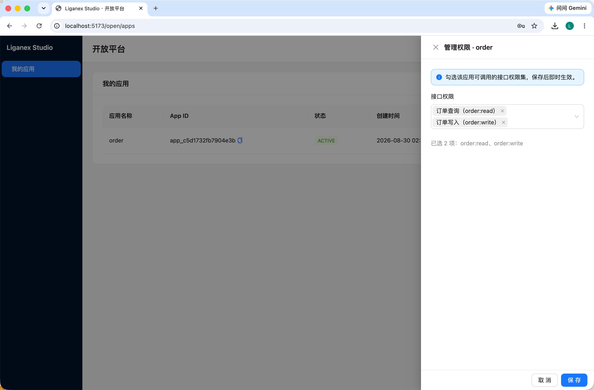
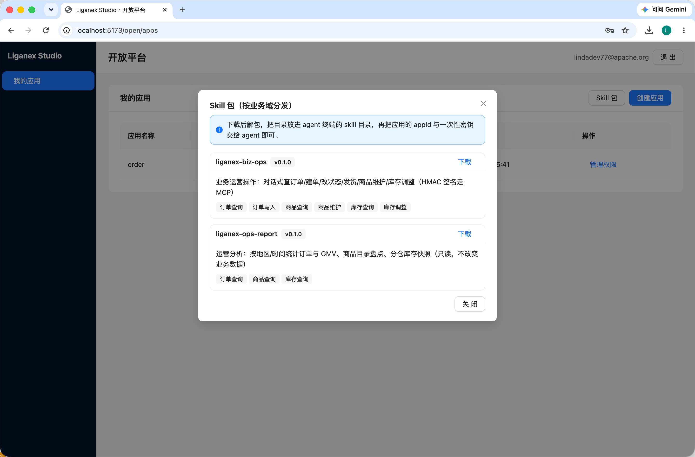
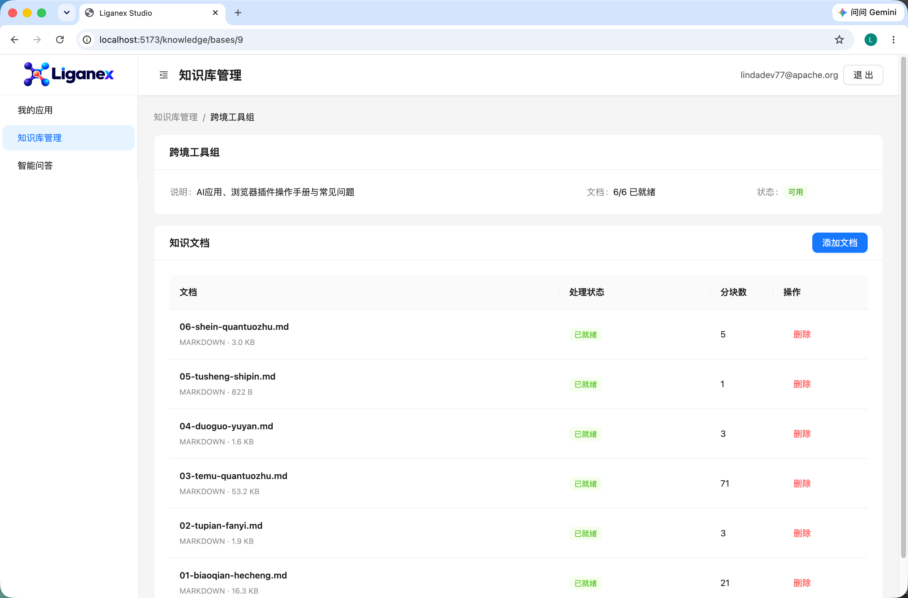
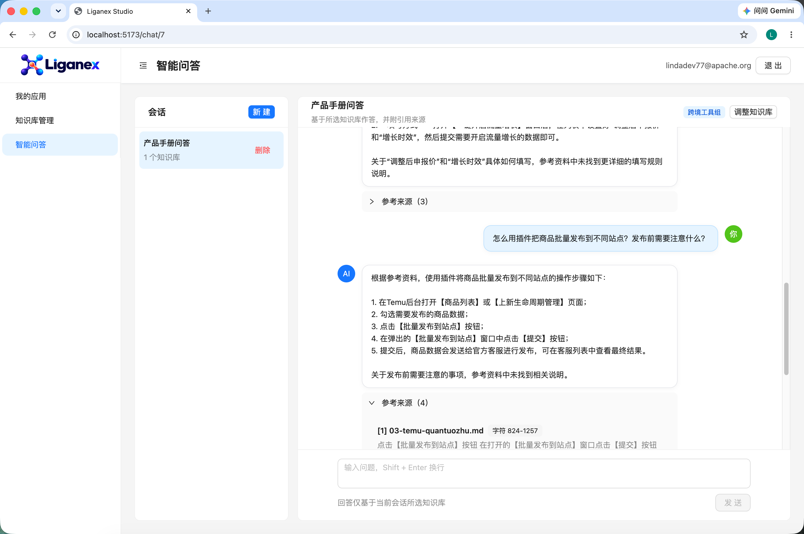

<p align="center">
  
</p>

> Agent 应用生态的连接层 —— 让模型接得上工具，让开发者接得上平台，让用户接得上服务。
>
> 以**业务运营场景**（订单 / 商品 / 库存）为落地场景，验证 MCP + Skill + 客户端 + 开放平台的端到端可行性。

[](LICENSE)
[](https://modelcontextprotocol.org)
[](https://spring.io)
[](#)

---

## 这是什么

Liganex 是一套围绕 **Model Context Protocol (MCP)** 构建的开源实验性项目，目标是把"Agent 应用生态"这件事从概念落到一套能跑、能演示、能讲清楚的系统。

它包含四块咬合的组件：

| 组件 | 定位 | 仓库 |
|---|---|---|
| **Liganex MCP Server** | 供给侧：把业务数据与能力暴露为 MCP tools | `liganex-mcp` |
| **Liganex Studio** | 客户端：轻量 MCP Host / 编排运行时（B 端前端 + 后端，同仓） | `server/liganex-studio-backend` + `studio-frontend` |
| **Liganex Skills** | 能力封装：面向业务领域的 Skill 包 | `liganex-skills` |
| **Liganex Hub** | 分发：Skill 注册表 + MCP Server 注册中心 | `liganex-hub` |

业务场景以**业务运营**为锚点：订单流转、商品目录、多仓库存 —— 用一套真实可跑的数据模型承载 Agent 与业务系统的对接。

项目已集成 **OpenSpec** 进行需求与变更管理：主规格沉淀在 [`openspec/specs/`](openspec/specs/)，每项变更在 [`openspec/changes/`](openspec/changes/) 中统一维护 proposal、design、specs 与 tasks，确保需求、设计和实现过程可追踪。

## 界面预览

### 应用权限管理

开放平台支持为应用按需配置 MCP 接口权限，权限保存后即时生效，为工具调用提供最小权限控制。



### Skill 包分发

Studio 按业务域展示可下载的 Skill 包及其能力范围，开发者可将包安装到 Agent 终端，通过应用凭证连接 Liganex MCP 服务。



### 知识库管理

用户可创建知识库、上传文档（支持 Markdown / PDF 等格式），系统自动分块并生成向量索引，供智能问答检索引用。知识库与文档按登录用户隔离，删除时级联清理向量映射记录。



### 智能问答

基于所选知识库进行对话式检索，AI 回答附带引用来源（文档名、分块 ID、摘要），支持流式输出。会话按用户隔离，内置分层记忆（L0 完整历史 / L1 近期窗口 / L2 滚动摘要）。



## 架构（四层）

```
┌─────────────────────────────────────────────┐
│                 Liganex Hub                   │
│   Skill Registry + MCP Server Registry + 文档  │
└───────────────┬───────────────────────────────┘
                │ 注册 / 发现
┌───────────────┴───────────────┐
│      Liganex Studio (客户端)     │ ← 轻量 MCP Host
│  编排 · 工具路由 · 上下文管理     │
└───────┬───────────────────┬─────┘
        │ 调用              │ 加载
┌───────▼───────┐    ┌──────────────▼──────────────┐
│  Liganex MCP  │    │        Liganex Skills        │
│    Server     │    │ replenishment · margin · ... │
│ 业务数据/工具  │    └──────────────────────────────┘
└───────────────┘
```

## 仓库清单

| 仓库 | 内容 | 优先级 |
|---|---|---|
| `liganex` | 本仓库 —— 总入口、架构总览、Roadmap | P0 |
| `liganex-mcp` | Java + Spring Boot 实现的 MCP Server | P0 |
| `liganex-docs` | 设计文档、Spec、ADR | P0 |
| `liganex-studio`（已并入本仓） | 客户端运行时 → `server/liganex-studio-backend/` + `studio-frontend/` | P1 |
| `liganex-skills` | 业务领域 Skill 包（MIT） | P1 |
| `liganex-hub` | 注册表与分发 | P2 |
| `liganex-support` | 智能客服问答示例 | P2 |
| `.github` | 组织级 CI / 模板 | P0 |

> 前后端同仓：Studio 客户端后端位于 `server/liganex-studio-backend/`（Spring Boot 4.1 多模块之一），
> 前端位于 `studio-frontend/`（React 19 + Vite 8 + antd 6），不单独拆前端仓（对齐 Dify / Coze Studio / Langflow）。
>
> 本仓目录结构（后端为 Maven 多模块，前端为独立 Vite 工程）：
> ```
> liganex/
> ├── server/                      # 后端多模块（liganex-server 聚合 POM，Spring Boot 4.1 + Java 21）
> │   ├── liganex-common/          # 公共工具（占位）
> │   ├── liganex-order/           # 订单领域（占位，当前由 studio-backend 承载，ADR-0009 服务化就绪）
> │   ├── liganex-mcp/             # MCP Server（占位）
> │   └── liganex-studio-backend/  # ★ Studio 后端：auth / 订单 / 开放平台 / MCP 鉴权
> ├── studio-frontend/             # ★ Studio 前端：React 19 + Vite 8 + antd 6
> ├── infra/local-dev/             # 本地基础设施（PG + Redis + RocketMQ）
> ├── docs/adr/                    # 架构决策记录
> └── openspec/                    # 变更提案
> ```

## 本地起服（Quick Start）

最小可跑通的全栈链路：**基础设施（PG / Redis）→ Studio 后端 → Studio 前端**。完整环境搭建（含 OrbStack、RocketMQ、踩坑记录）见 [docs/dev-setup.md](docs/dev-setup.md)。

```bash
# 0) 基础设施：PG(5432) + Redis(6379)
cd infra/local-dev && cp .env.example .env && docker compose up -d

# 1) 后端（必须用 JDK 21，系统默认是 JDK 8）
export JAVA_HOME=/Users/Admin/Dev/tools/jdk21/Contents/Home
cd server/liganex-studio-backend
export LIGANEX_JWT_SECRET="$(openssl rand -base64 48)"
export LIGANEX_INTERNAL_API_KEY="dev-internal-key"
export LIGANEX_APP_SECRET_MASTER_KEY="$(openssl rand -base64 32)"
mvn spring-boot:run
#   → 监听 http://127.0.0.1:8081

# 2) 前端（另开终端）
cd studio-frontend
npm install            # 首次或依赖变更；已含 lightningcss 原生二进制（arm64 macOS）
npm run dev           # Vite 反代 /api → http://127.0.0.1:8081，访问 http://127.0.0.1:5173
```

> 改 Java 版本后务必 `mvn clean` 全量重编（增量编译不会重编未改源码，会残留旧字节码导致运行时 `UnsupportedClassVersionError`）。密钥经环境变量注入（`application.yml` 仅含 `${LIGANEX_*:}` 占位），缺失会 fail-fast 拒启动（ADR-0007：密钥不入库）。`spring-boot:run` 需在模块目录内执行：Boot 4.1 fork 子进程跑应用，Maven `-D` 参数不会透传。

**验证闭环**：打开 `http://127.0.0.1:5173` → 注册 → 登录 → 「我的应用」创建应用（拿到一次性 appSecret）→ 管理权限勾选（下拉仅展示已开放的权限，当前 6 项：`order:read` / `order:write` / `product:read` / `product:write` / `inventory:read` / `inventory:write`，由 8 个真实 MCP 工具承接：订单查/建/改状态/发货 + 商品查/写 + 库存查/调整），即可在页面跑通。后端 `GET /actuator/health` 返回 `{"status":"UP"}` 即就绪。

**Skill 闭环**（对话式打通业务数据）：skill 以**客户分发 zip**交付，一个业务域一个包（系统复杂时由多个包各自覆盖各自场景）。源统一放在仓库顶层 `skills/<name>/`（随代码一起提交管理，每个目录自包含：`skill.json` 声明名称/版本/所需权限 + `SKILL.md` + 客户 `README` + `scripts/liganex_mcp.py` 签名客户端）。`scripts/package-skill.sh` 把全部（或指定）skill 打成 `dist/<name>-<版本>.zip` 并同步进后端资源、生成清单。服务部署后：`GET /mcp/v1/skills` 返回可用包清单（名称/版本/说明/所需权限/下载地址），`GET /mcp/v1/skills/<name>.zip` 按清单提供下载（开放平台「我的应用」页「Skill 包」弹窗同款入口）。客户解包后把目录放进 agent 终端（Qoder / workbuddy 等）的 skill 目录，把应用的 appId + 一次性密钥交给 agent，即可对话操作对应业务域的数据。每次调用走 HMAC 签名（`POST\n/mcp/v1\n{ts}\n{nonce}\n{body}`）+ scope 校验 + 配额 + 审计（ADR-0002/0009）。当前两个包：`liganex-biz-ops`（业务运营操作，6 权限 8 工具）与 `liganex-ops-report`（运营分析报表，只读 3 权限）。改 skill 内容后须重跑打包脚本再部署。

## 技术选型要点

- **后端**：Spring Boot 4.1 + Java 21 LTS（企业级 Java 主栈，MCP Java SDK 可用，生态稀缺）
- **协议**：MCP **2026-07-28** 无状态核心 —— 单端点 POST、移除 `initialize`/`Mcp-Session-Id`、每请求 `_meta` 携带版本能力、`server/discover` 强制发现
- **工具标注**：用 `tool.annotations`（`readOnlyHint` / `destructiveHint` / `idempotentHint` / `openWorldHint`）声明副作用等级，既是安全也是体验优化
- **展示**：MCP Apps（`outputSchema` + `structuredContent`）让库存/利润看板结构化渲染

## 安全取舍（实验项目）

当前版本**不实现** OAuth 2.1 / Token Audience Binding / Step-Up Auth（避免吞噬工作量），但保留工程底线：

- tool annotations 声明副作用等级
- `inputSchema` 参数校验（协议强制）
- 单一 API Key + 工具白名单（约一小时工作量）
- 全量审计日志（一张表）
- 演示用只读 / 影子数据副本

详见 [`docs/adr/ADR-0002-auth-scope.md`](docs/adr/ADR-0002-auth-scope.md)。

## 路线

1. **P0**：主仓 README + `liganex-mcp` 骨架（2026-07-28 请求头处理 + annotations）
2. **P1**：业务 Skill 包（运营报表 / 异常订单处理）
3. **P1**：`liganex-studio` 客户端运行时
4. **P2**：`liganex-hub` 注册表 + 智能客服

## Topics

`mcp` · `model-context-protocol` · `agent` · `java` · `spring-boot` · `react` · `typescript`

## 开源许可

本项目基于 [Apache License 2.0](LICENSE) 授权（`SPDX-License-Identifier: Apache-2.0`）。

```
Copyright 2026 lindaailabs

Licensed under the Apache License, Version 2.0 (the "License");
you may not use this file except in compliance with the License.
You may obtain a copy of the License at

    http://www.apache.org/licenses/LICENSE-2.0

Unless required by applicable law or agreed to in writing, software
distributed under the License is distributed on an "AS IS" BASIS,
WITHOUT WARRANTIES OR CONDITIONS OF ANY KIND, either express or implied.
See the License for the specific language governing permissions and
limitations under the License.
```

允许自由使用、修改与再分发（含商业用途），但须保留版权声明与许可声明；作者不承担任何担保责任。完整条款见 [LICENSE](LICENSE)。
